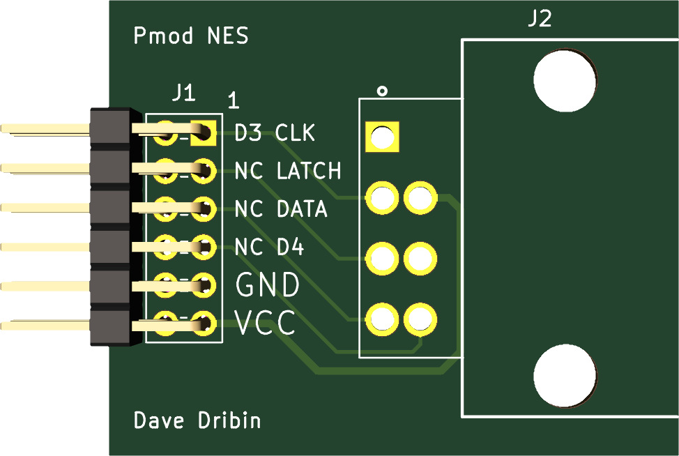
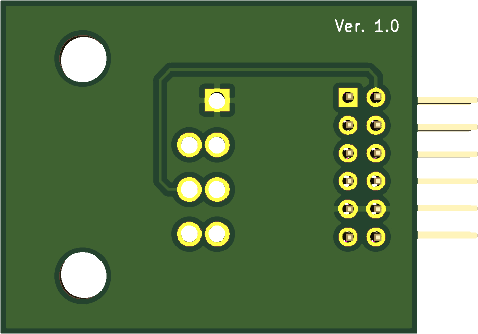

# NES Port Pmod Adapter

A [Pmod][pmod] adapter for a console-side (male) NES port, specifically the [Raphnet right-angle NES controller connector][raphnet].

Top of PCB:

Bottom of PCB:

[pmod]: https://reference.digilentinc.com/pmod/start
[raphnet]: https://www.raphnet-tech.com/products/nes_controller_connector/index.php
